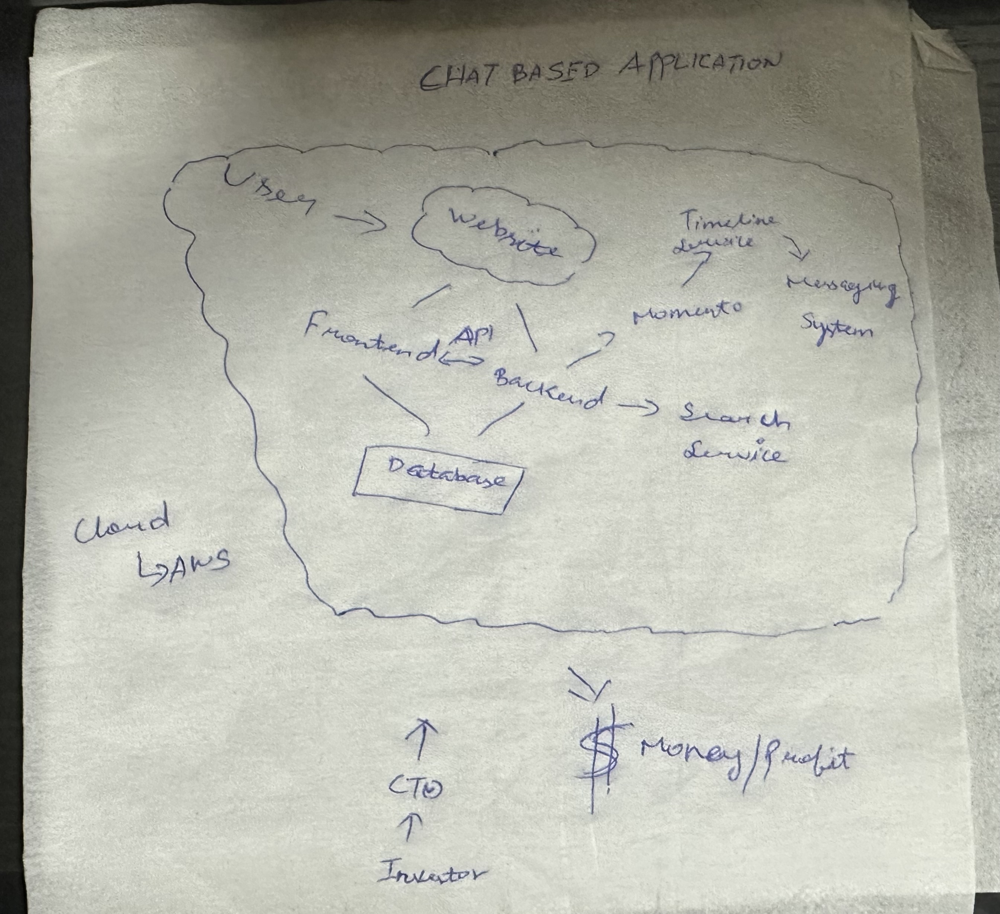
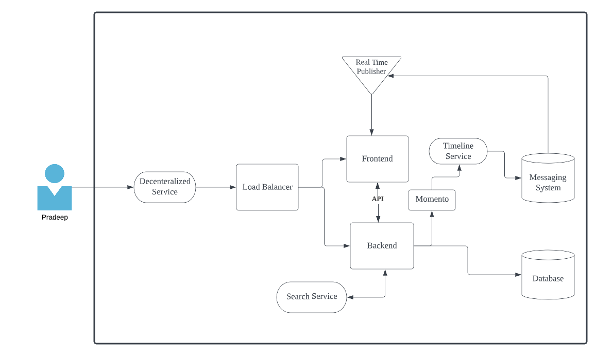
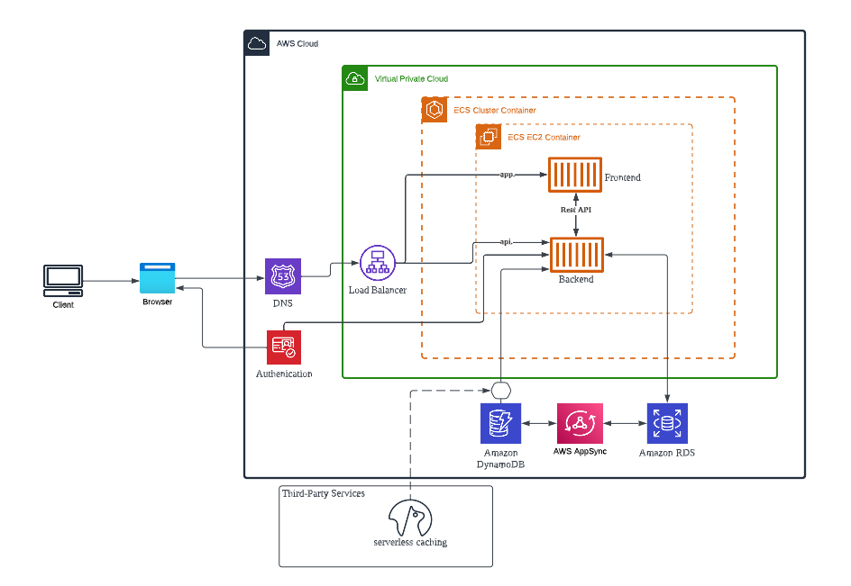
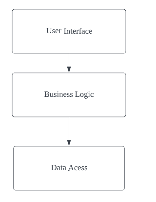
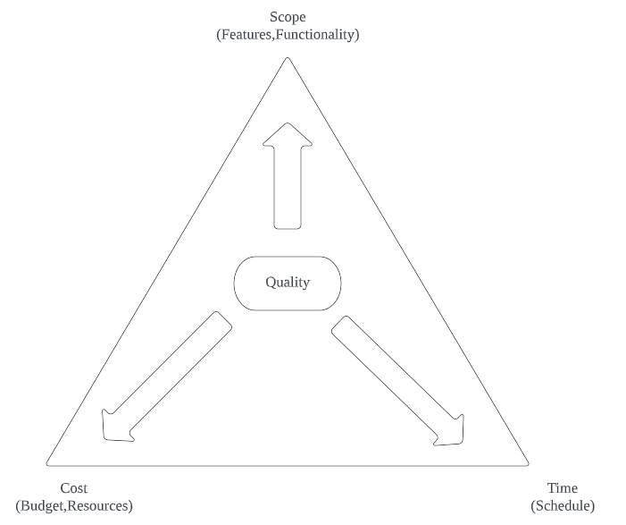

- [Week-0 Billing and Architecture](#week-0-billing-and-architecture)
  - [Task List of 12/02/2023 to 18/02/2023](#task-list-of-12022023-to-18022023)
  - [Conceptual and Napkin Diagram](#conceptual-and-napkin-diagram)
      - [Napkin Design](#napkin-design)
      - [Conceptual Design](#conceptual-design)
      - [Logical Architectual Diagram](#logical-architectual-diagram)
      - [Physical Design](#physical-design)
      - [Application Layer](#application-layer)
  - [Chirag's Week 0 - Spend Considerations](#chirags-week-0---spend-considerations)
      - [Aws Pricing basics and Free Tier](#aws-pricing-basics-and-free-tier)
  - [Ashish's Week 0 - Security Considerations](#ashishs-week-0---security-considerations)
      - [CyberSecurity Goal](#cybersecurity-goal)
      - [Cloud Security](#cloud-security)
      - [Why care about cloud security](#why-care-about-cloud-security)
      - [Why cloud security requires practice](#why-cloud-security-requires-practice)
      - [Cloud Security Best Practice](#cloud-security-best-practice)
      - [Security Best Practices](#security-best-practices)
  - [Install AWS CLI](#install-aws-cli)
    - [Create a new User and Generate AWS Credentials](#create-a-new-user-and-generate-aws-credentials)
    - [Set Env Vars](#set-env-vars)
    - [Check that the AWS CLI is working and you are the expected user](#check-that-the-aws-cli-is-working-and-you-are-the-expected-user)
  - [Enable Billing](#enable-billing)
  - [Creating a Billing Alarm](#creating-a-billing-alarm)
    - [Create SNS Topic](#create-sns-topic)
      - [Create Alarm](#create-alarm)
  - [Create an AWS Budget](#create-an-aws-budget)
  - [Well Architected Tool](#well-architected-tool)
  - [Tech Stacks](#tech-stacks)
  - [Iron triangle Management](#iron-triangle-management)
    - [Notes](#notes)
      - [How to Take the notes of RG during the CTO/Client meeting?](#how-to-take-the-notes-of-rg-during-the-ctoclient-meeting)
      - [Meets the Good Requirements:](#meets-the-good-requirements)
      - [Addresses the Risks,Assumptions \& Constraints](#addresses-the-risksassumptions--constraints)
      - [From gathering the RRACs](#from-gathering-the-rracs)
      - [TOGAF](#togaf)

# Week-0 Billing and Architecture

## Task List of 12/02/2023 to 18/02/2023
- [x] Week 0 - Live Streamed Video(13/02/2023)
- [x] Chirag's Week 0 - Spend Considerations (14/02/2023)
- [x] Ashish's Week 0 - Security Considerations (14/02/2023)
- [x] Recreate Conceptual Diagram in Lucid Charts or on a Napkin (15/02/2023)
- [x] Logical Architectual Diagram in Lucid Charts (15/02/2023)
- [x] Create an Admin User(16/02/2023)
- [x] Use CloudShell(16/02/2023)
- [x] Generate AWS Credentials(16/02/2023)
- [x] Installed AWS CLI(16/02/2023)
- [x] Create a Billing Alarm (14/02/2023)
- [x] Create a Budget (14/02/2023)
- [ ] Well Architected Tool(17/02/2023)

## Conceptual and Napkin Diagram
- Created by business stakeholders and architects
- organizers and define concept and rules
- Napkin Design
#### Napkin Design
 

#### Conceptual Design


#### Logical Architectual Diagram
- Defines the system 
- Environment without actual names or size

#### Physical Design
- Representation of the actual thing that was built
- Ip Address name
#### Application Layer


##  Chirag's Week 0 - Spend Considerations
#### Aws Pricing basics and Free Tier
- AWS Bill
  - Pricing Varies depends on the region
  - Created a budgets(2 budgets for free in free tier)
- Billing Alert
  - Created a Bill alerts for the free tier account
  - Created a alarm for the boot camp
  - 10 alarm  are free for the free tier
- Cost Explorer
  - Calculate AWS estimates Cost for service
    - I have checked the ec2 instance cost for 1 month using aws calculator
  - Check AWS allocation tags
  - Cost allocation tags is a key value pair
  - Free forever vs Free for 12 months
    - https://aws.amazon.com/free/
  
##  Ashish's Week 0 - Security Considerations
#### CyberSecurity Goal
  - Identify & inform the business on any technical risk that the business maybe exposed to.
#### Cloud Security
  - Cyber security that protects the data, application and services assocaited wih cloud environments form both external and interna security threats
#### Why care about cloud security
- Reducing impact of breach
- Protecting
- Reducing the human error
#### Why cloud security requires practice
- Complexity
- Always chasing out tail with new service
- Bad hackers are improving their game
#### Cloud Security Best Practice
- Enable MFA
- Create an Organization unit
- Enable AWS Cloud Trail
- Create IAM User
  - Tips
    - Enable MFA
    - Principle of Least Privilege
  - Create IAM roles using Custom purpose
  - Create Group
  - Create Roles
  - Create policies
- Security Control Policies
- Shared Responsibility Models

#### Security Best Practices
- Data Protection & Residency in accordance to Security Policy
- IAM with Least Privilege
- Governance & Compliance of AWS Services being used 
  - Global vs Regional Services
  - Compliant Services
- Shared Responsibility of Threat Detection
- Inicident Response Plans to include Cloud

## Install AWS CLI

- Iinstall the AWS CLI when our Gitpod enviroment lanuches.
- Set AWS CLI to use partial autoprompt mode to make it easier to debug CLI commands.

Update our `.gitpod.yml` to include the following task.

```sh
tasks:
  - name: aws-cli
    env:
      AWS_CLI_AUTO_PROMPT: on-partial
    init: |
      cd /workspace
      curl "https://awscli.amazonaws.com/awscli-exe-linux-x86_64.zip" -o "awscliv2.zip"
      unzip awscliv2.zip
      sudo ./aws/install
      cd $THEIA_WORKSPACE_ROOT
```

We'll also run these commands indivually to perform the install manually

### Create a new User and Generate AWS Credentials

- Go to (IAM Users Console](https://us-east-1.console.aws.amazon.com/iamv2/home?region=us-east-1#/users) andrew create a new user
- `Enable console access` for the user
- Create a new `Admin` Group and apply `AdministratorAccess`
- Create the user and go find and click into the user
- Click on `Security Credentials` and `Create Access Key`
- Choose AWS CLI Access
- Download the CSV with the credentials

### Set Env Vars

Set these credentials for the current bash terminal
```
export AWS_ACCESS_KEY_ID=""
export AWS_SECRET_ACCESS_KEY=""
export AWS_DEFAULT_REGION=us-east-1
```
Tell Gitpod to remember these credentials if we relaunch our workspaces
```
gp env AWS_ACCESS_KEY_ID=""
gp env AWS_SECRET_ACCESS_KEY=""
gp env AWS_DEFAULT_REGION=us-east-1
```

### Check that the AWS CLI is working and you are the expected user

```sh
aws sts get-caller-identity
```

You should see something like this:
```json
{
    "UserId": "XXXX",
    "Account": "XXXX",
    "Arn": "XXXXX"
}
```

## Enable Billing 

- In your Root Account go to the [Billing Page](https://console.aws.amazon.com/billing/)
- Under `Billing Preferences` Choose `Receive Billing Alerts`
- Save Preferences

## Creating a Billing Alarm

### Create SNS Topic

We'll create a SNS Topic
```sh
aws sns create-topic --name billing-alarm
```

```sh
aws sns subscribe \
    --topic-arn TopicARN \
    --protocol email \
    --notification-endpoint your@email.com
```

Check your email and confirm the subscription

#### Create Alarm

```sh
aws cloudwatch put-metric-alarm --cli-input-json file://aws/json/alarm_config.json
```

## Create an AWS Budget

```sh
aws sts get-caller-identity --query Account --output text
```
```sh
aws budgets create-budget \
    --account-id AccountID \
    --budget file://aws/json/budget.json \
    --notifications-with-subscribers file://aws/json/budget-notifications-with-subscribers.json
```
## Well Architected Tool
The 6 pillars of AWS well architected tools are
1. Operational Excellence
2. Security
3. Relability
4. Performance Efficency 
5. Cost Optimization
6. Sustainability

## Tech Stacks
- React
- Python

## Iron triangle Management



### Notes
#### How to Take the notes of RG during the CTO/Client meeting?
- Ephemeral-First Micro-blogging platform
- Fractional CTO
- Partly development App-keep or rebuild?
- How to monetize the platform
- frontend=javascript using react
- backend Application = python using flask
- api only
- be careful with the budget
- monolith into micorservice
- user content(upload?)
- Users-College students,Younger Students,professionals
  - User Validation?
  - Age limit?
- AWS 
  - What services?
  - Set up budget monitoring
- User Engagement
- Technical report due for investors
  - Architecture
  - Budget
  - ongoing cost Estimate

Why User Personas?

| Personas      |                         Lessons Learned                          |
| ------------- | :--------------------------------------------------------------: |
| Tony CTO      |                   not all context is relevant                    |
| Web dev group |                        no true greenfield                        |
| Investors     |                      manage time and effort                      |
| Investors     | - Trade offs for all projects <br> - Learn iterate and show back |

#### Meets the Good Requirements:

Requirements must be 
 - verifiable 
 - monitorable
 - traceable
 - feasible
  
Examples
  - Meets ISO Standards
  - 99.9% uptime
  - User can do specific task
  
#### Addresses the Risks,Assumptions & Constraints
- Risks can prevent the project from being successfull
  - SPOFs
  - User Commitment
  - Late Delivery
- Assumptions are factors held as true for the planning & implementations phases
  - sufficient network bandwidth
  - stake holders
  - budget is approved
- Constraints are policy or technical limitations for the projects
  - Time
  - Budget
  - Vendor Selection

#### From gathering the RRACs 

Its Important to Develop a Common Dictionary 
- Ask dumb questions
- play be the packet
- Document Everything

#### TOGAF
- The most populat framework for EA
- Common dictory for words convey desired outcomes
- Meta-model for the creation of underlying projects
- Maps closely to the well-architected tool
