# Week 1 — App Containerization
---------------

- [Week 1 — App Containerization](#week-1--app-containerization)
  - [Task List of 19/02/2023 to 25/02/2023](#task-list-of-19022023-to-25022023)
  - [Backend Docker creation](#backend-docker-creation)
    - [Run Python](#run-python)
    - [Add Dockerfile](#add-dockerfile)
      - [Docker File Link](#docker-file-link)
      - [Build the backend container](#build-the-backend-container)
      - [Run the backend container](#run-the-backend-container)
  - [Frontend Docker creation](#frontend-docker-creation)
    - [Run NPM Install](#run-npm-install)
    - [Create Docker File](#create-docker-file)
      - [Docker File Link](#docker-file-link-1)
      - [Build the Frontend Container](#build-the-frontend-container)
      - [Run the Frontend Container](#run-the-frontend-container)
  - [Multiple Containers](#multiple-containers)
      - [Create a docker-compose file](#create-a-docker-compose-file)
  - [Document the Notification Endpoint for the OpenAI Document](#document-the-notification-endpoint-for-the-openai-document)
    - [API Code](#api-code)
    - [Open API document preview](#open-api-document-preview)
  - [Write a Flask Backend Endpoint for Notifications](#write-a-flask-backend-endpoint-for-notifications)
    - [Notification Backend Response](#notification-backend-response)
    - [Notification Backend Code Commit Link](#notification-backend-code-commit-link)
  - [Write a React Page for Notifications](#write-a-react-page-for-notifications)
    - [Notification Frontend Screen](#notification-frontend-screen)
    - [Notification Frontend Code Commit Link](#notification-frontend-code-commit-link)
  - [Run DynamoDB Local Container and ensure it works](#run-dynamodb-local-container-and-ensure-it-works)
    - [Docker setup for DynamoDB](#docker-setup-for-dynamodb)
      - [Make Sure Docker is Running](#make-sure-docker-is-running)
        - [Create a table](#create-a-table)
        - [Create an Item](#create-an-item)
        - [List Tables](#list-tables)
        - [Get Records](#get-records)
  - [Run Postgres Container and ensure it works](#run-postgres-container-and-ensure-it-works)
    - [Docker setup for Postgres](#docker-setup-for-postgres)
    - [Gitpod client setup for Postgres](#gitpod-client-setup-for-postgres)
    - [Postgres Plugin setup check](#postgres-plugin-setup-check)
  - [References](#references)
    - [VSCode Docker Extension](#vscode-docker-extension)
      - [Return the container id into an Environment variables](#return-the-container-id-into-an-environment-variables)
      - [Get Container Images or Running Container Ids](#get-container-images-or-running-container-ids)
      - [Send Curl to Test Server](#send-curl-to-test-server)
      - [Check Container Logs](#check-container-logs)
      - [Debugging  adjacent containers with other containers](#debugging--adjacent-containers-with-other-containers)
      - [Gain Access to a Container](#gain-access-to-a-container)
      - [Delete an Image](#delete-an-image)
      - [Overriding Ports](#overriding-ports)
---------------
## Task List of 19/02/2023 to 25/02/2023
---------------
- [x] Watched Grading Homework Summaries(19/02/2023)
- [x] Watched Week 1 - Live Streamed Video(19/02/2023)
- [ ] Watched Ashish's Week 1 - Container Security(24/02/2023)
- [ ] Week 1 - Containerize Application (Dockerfiles, Docker Compose)(24/02/2023)
- [x] Document the Notification Endpoint for the OpenAI Document(23/02/2023)
- [x] Write a Flask Backend Endpoint for Notifications(23/02/2023)
- [x] Write a React Page for Notifications(23/02/2023)
- [x] Run DynamoDB Local Container and ensure it works(23/02/2023)
- [x] Run Postgres Container and ensure it works(24/02/2023)

---------------
## Backend Docker creation
---------------

### Run Python

```sh
cd backend-flask
export FRONTEND_URL="*"
export BACKEND_URL="*"
python3 -m flask run --host=0.0.0.0 --port=4567
cd ..
```

- make sure to unlock the port on the port tab
- open the link for 4567 in your browser
- append to the url to `/api/activities/home`
- you should get back json

### Add Dockerfile

Create a file here: `backend-flask/Dockerfile`

```dockerfile
FROM python:3.10-slim-buster
WORKDIR /backend-flask
COPY requirements.txt requirements.txt
RUN pip3 install -r requirements.txt
COPY . .
ENV FLASK_ENV=development
EXPOSE ${PORT}
CMD [ "python3", "-m" , "flask", "run", "--host=0.0.0.0", "--port=4567"]
```
#### Docker File Link
[Dockerfile]([https://](https://github.com/pradytpk/aws-bootcamp-cruddur-2023/blob/main/backend-flask/Dockerfile))

#### Build the backend container

```sh
docker build -t  backend-flask ./backend-flask
```
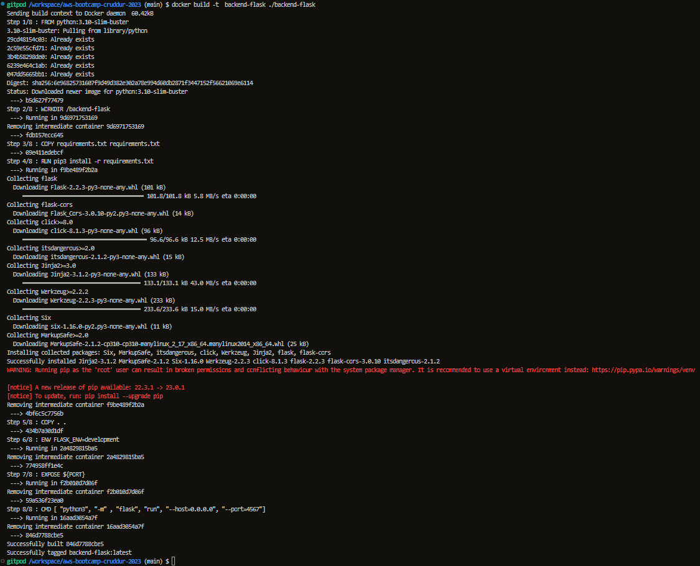

#### Run the backend container
 
```sh
docker run --rm -p 4567:4567 -it backend-flask
```
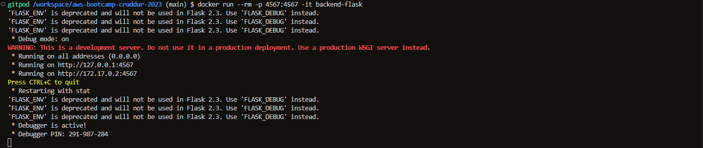

---------------
## Frontend Docker creation
---------------

### Run NPM Install

```
cd frontend-react-js
npm i
```
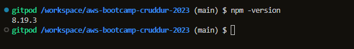

### Create Docker File

Create a file here: `frontend-react-js/Dockerfile`

```dockerfile
FROM node:16.18
ENV PORT=3000
COPY . /frontend-react-js
WORKDIR /frontend-react-js
RUN npm install
EXPOSE ${PORT}
CMD ["npm", "start"]
```
#### Docker File Link
[Dockerfile]([https://](https://github.com/pradytpk/aws-bootcamp-cruddur-2023/blob/main/frontend-react-js/Dockerfile))


#### Build the Frontend Container

```sh
docker build -t frontend-react-js ./frontend-react-js
```
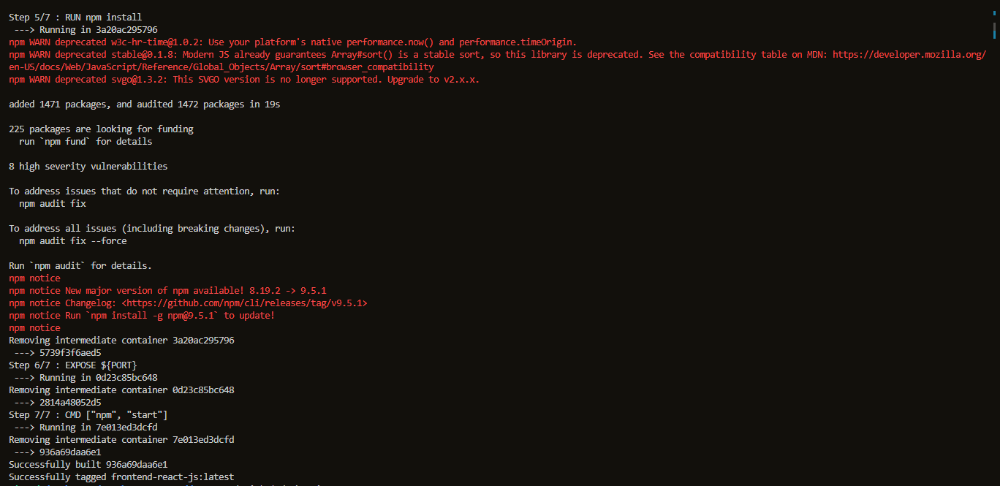
#### Run the Frontend Container

```sh
docker run -p 3000:3000 -d frontend-react-js
```
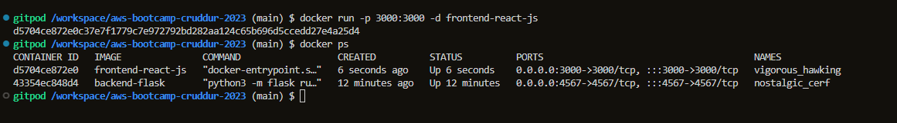

---------------
## Multiple Containers
---------------

#### Create a docker-compose file

Create `docker-compose.yml` at the root of your project.

```yaml
version: "3.8"
services:
  backend-flask:
    environment:
      FRONTEND_URL: "https://3000-${GITPOD_WORKSPACE_ID}.${GITPOD_WORKSPACE_CLUSTER_HOST}"
      BACKEND_URL: "https://4567-${GITPOD_WORKSPACE_ID}.${GITPOD_WORKSPACE_CLUSTER_HOST}"
    build: ./backend-flask
    ports:
      - "4567:4567"
    volumes:
      - ./backend-flask:/backend-flask
  frontend-react-js:
    environment:
      REACT_APP_BACKEND_URL: "https://4567-${GITPOD_WORKSPACE_ID}.${GITPOD_WORKSPACE_CLUSTER_HOST}"
    build: ./frontend-react-js
    ports:
      - "3000:3000"
    volumes:
      - ./frontend-react-js:/frontend-react-js
networks: 
  internal-network:
    driver: bridge
    name: cruddur
```

---------------
## Document the Notification Endpoint for the OpenAI Document
---------------
### API Code
```yml
  /api/activities/notifications: 
    get:
      description: 'Return a feed of activity for all of those that I follow'
      tags:
        - activities
      parameters: []
      responses:
        '200':
          description: Return array of activities
          content:
            application/json:
              schema:
                type: array
                items:
                  $ref: '#/components/schemas/Activity'
```
### Open API document preview
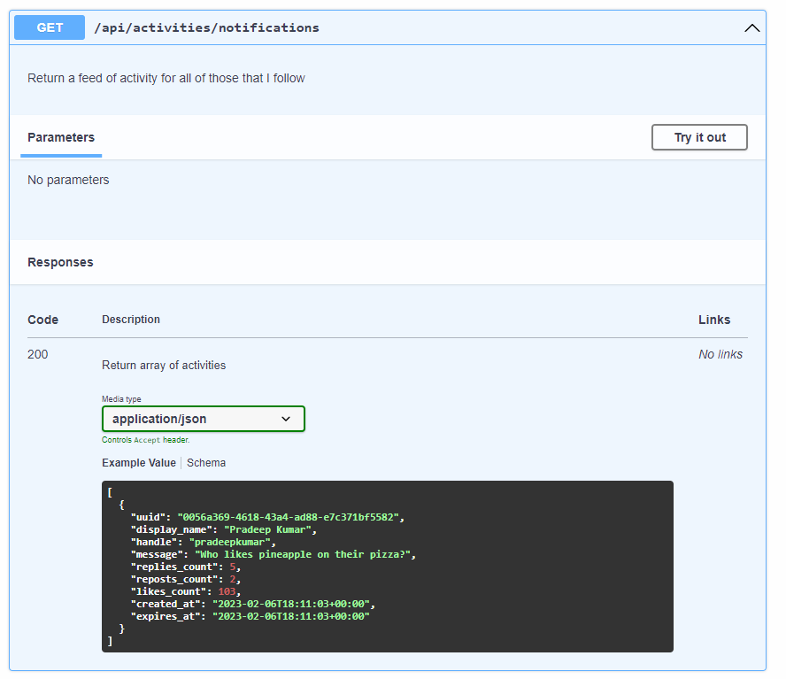

---------------
## Write a Flask Backend Endpoint for Notifications
---------------
### Notification Backend Response
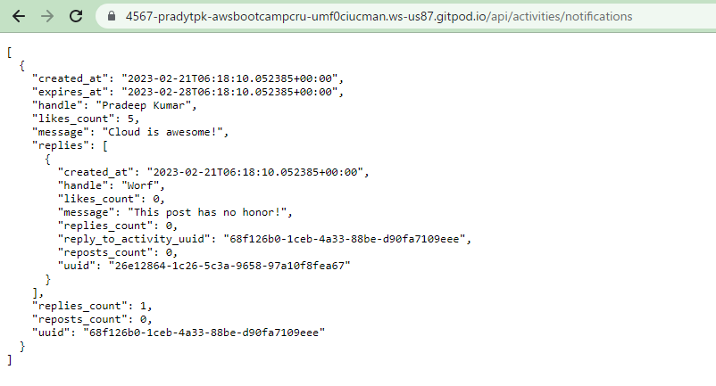
### Notification Backend Code Commit Link
- https://github.com/pradytpk/aws-bootcamp-cruddur-2023/commit/09c8022b6dac0d96811b8ea60735a939a4681e8c

---------------
## Write a React Page for Notifications
---------------

### Notification Frontend Screen
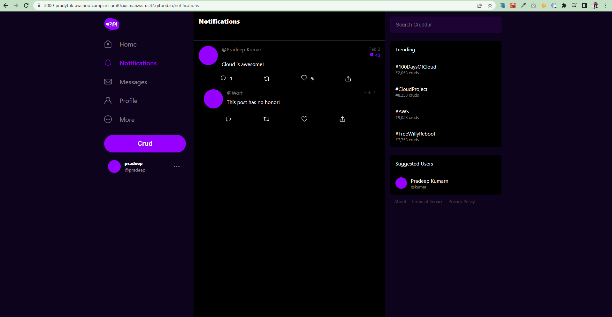
### Notification Frontend Code Commit Link
- https://github.com/pradytpk/aws-bootcamp-cruddur-2023/commit/ebcbc6099122e26bff1b0c166d44a0bd764a454d

---------------
## Run DynamoDB Local Container and ensure it works
---------------

### Docker setup for DynamoDB

```yaml
services:
  dynamodb-local:
    # https://stackoverflow.com/questions/67533058/persist-local-dynamodb-data-in-volumes-lack-permission-unable-to-open-databa
    # We needed to add user:root to get this working.
    user: root
    command: "-jar DynamoDBLocal.jar -sharedDb -dbPath ./data"
    image: "amazon/dynamodb-local:latest"
    container_name: dynamodb-local
    ports:
      - "8000:8000"
    volumes:
      - "./docker/dynamodb:/home/dynamodblocal/data"
    working_dir: /home/dynamodblocal
```
```yaml
volumes: 
- "./docker/dynamodb:/home/dynamodblocal/data"
```
#### Make Sure Docker is Running
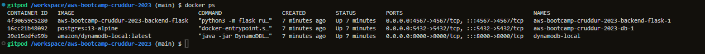

##### Create a table
```
aws dynamodb create-table \
    --endpoint-url http://localhost:8000 \
    --table-name Music \
    --attribute-definitions \
        AttributeName=Artist,AttributeType=S \
        AttributeName=SongTitle,AttributeType=S \
    --key-schema AttributeName=Artist,KeyType=HASH AttributeName=SongTitle,KeyType=RANGE \
    --provisioned-throughput ReadCapacityUnits=1,WriteCapacityUnits=1 \
    --table-class STANDARD
```
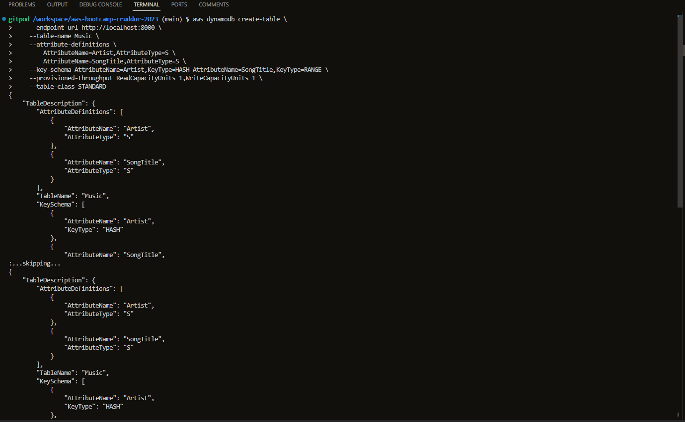

##### Create an Item
```
aws dynamodb put-item \
    --endpoint-url http://localhost:8000 \
    --table-name Music \
    --item \
        '{"Artist": {"S": "No One You Know"}, "SongTitle": {"S": "Call Me Today"}, "AlbumTitle": {"S": "Somewhat Famous"}}' \
    --return-consumed-capacity TOTAL  
```
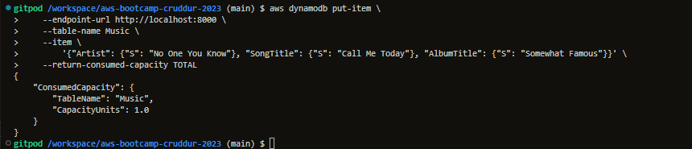
##### List Tables
```
aws dynamodb list-tables --endpoint-url http://localhost:8000
```
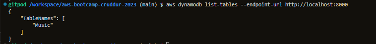
##### Get Records
```
aws dynamodb scan --table-name Music --query "Items" --endpoint-url http://localhost:8000
```
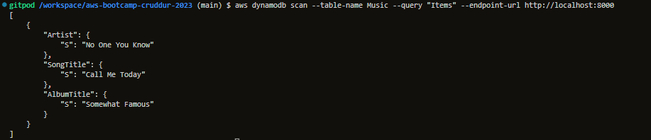

---------------
## Run Postgres Container and ensure it works
---------------
### Docker setup for Postgres
```yaml
services:
  db:
    image: postgres:13-alpine
    restart: always
    environment:
      - POSTGRES_USER=postgres
      - POSTGRES_PASSWORD=password
    ports:
      - '5432:5432'
    volumes: 
      - db:/var/lib/postgresql/data
volumes:
  db:
    driver: local
```

```yaml
volumes: 
  - db:/var/lib/postgresql/data
volumes:
  db:
    driver: local
```
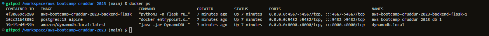

### Gitpod client setup for Postgres

```sh
  - name: postgres
    init: |
      curl -fsSL https://www.postgresql.org/media/keys/ACCC4CF8.asc|sudo gpg --dearmor -o /etc/apt/trusted.gpg.d/postgresql.gpg
      echo "deb http://apt.postgresql.org/pub/repos/apt/ `lsb_release -cs`-pgdg main" |sudo tee  /etc/apt/sources.list.d/pgdg.list
      sudo apt update
      sudo apt install -y postgresql-client-13 libpq-dev
```
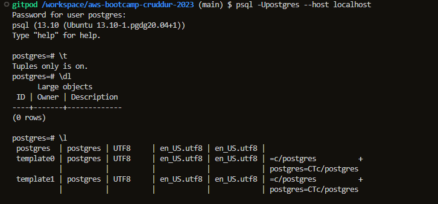

### Postgres Plugin setup check
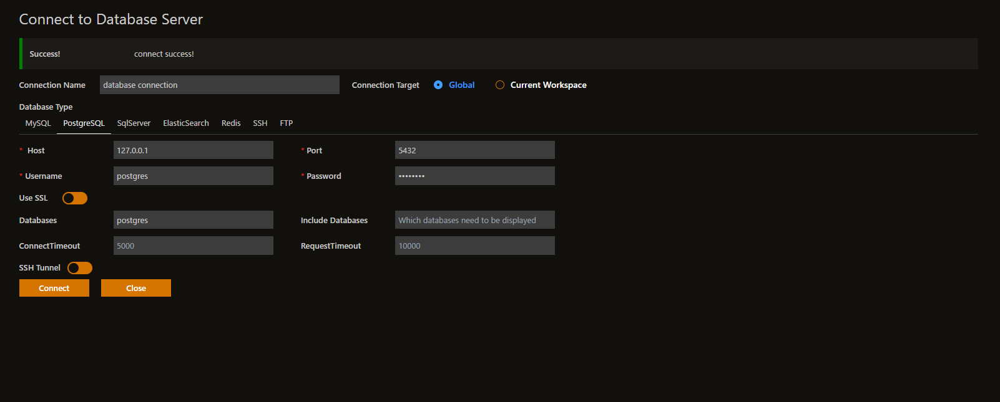

---------------
## References
---------------
Good Article for Debugging Connection Refused
https://pythonspeed.com/articles/docker-connection-refused/

###  VSCode Docker Extension

Docker for VSCode makes it easy to work with Docker

https://code.visualstudio.com/docs/containers/overview

> Gitpod is preinstalled with theis extension

```sh
FRONTEND_URL="*" BACKEND_URL="*" docker run --rm -p 4567:4567 -it backend-flask
export FRONTEND_URL="*"
export BACKEND_URL="*"
docker run --rm -p 4567:4567 -it -e FRONTEND_URL='*' -e BACKEND_URL='*' backend-flask
docker run --rm -p 4567:4567 -it  -e FRONTEND_URL -e BACKEND_URL backend-flask
unset FRONTEND_URL="*"
unset BACKEND_URL="*"
docker container run --rm -p 4567:4567 -d backend-flask
```

#### Return the container id into an Environment variables

```sh
CONTAINER_ID=$(docker run --rm -p 4567:4567 -d backend-flask)
```

#### Get Container Images or Running Container Ids

```
docker ps
docker images
```


#### Send Curl to Test Server

```sh
curl -X GET http://localhost:4567/api/activities/home -H "Accept: application/json" -H "Content-Type: application/json"
```

#### Check Container Logs

```sh
docker logs CONTAINER_ID -f
docker logs backend-flask -f
docker logs $CONTAINER_ID -f
```

####  Debugging  adjacent containers with other containers

```sh
docker run --rm -it curlimages/curl "-X GET http://localhost:4567/api/activities/home -H \"Accept: application/json\" -H \"Content-Type: application/json\""
```

busybosy is often used for debugging since it install a bunch of thing

```sh
docker run --rm -it busybosy
```

#### Gain Access to a Container

```sh
docker exec CONTAINER_ID -it /bin/bash
```

> You can just right click a container and see logs in VSCode with Docker extension
#### Delete an Image

```sh
docker image rm backend-flask --force
```

> docker rmi backend-flask is the legacy syntax, you might see this is old docker tutorials and articles.
> There are some cases where you need to use the --force
#### Overriding Ports

```sh
FLASK_ENV=production PORT=8080 docker run -p 4567:4567 -it backend-flask
```

> Look at Dockerfile to see how ${PORT} is interpolated

---------------