# 1. Week 2 — Distributed Tracing
- [1. Week 2 — Distributed Tracing](#1-week-2--distributed-tracing)
  - [1.1. Observability vs Monitoring](#11-observability-vs-monitoring)
    - [1.1.1. Current State of logging](#111-current-state-of-logging)
    - [1.1.2. Why logging is hard](#112-why-logging-is-hard)
    - [1.1.3. Why Observability](#113-why-observability)
    - [1.1.4. Observability vs Monitoring](#114-observability-vs-monitoring)
    - [1.1.5. Observability in AWS](#115-observability-in-aws)
    - [1.1.6. 3 Pillar of observability](#116-3-pillar-of-observability)
    - [1.1.7. Building Security Metrics logs for Tracing](#117-building-security-metrics-logs-for-tracing)
    - [1.1.8. Central Observability Platform - Security](#118-central-observability-platform---security)
  - [1.2. HoneyComb](#12-honeycomb)
    - [1.2.1. Setup Honeycomb API key in gitpod](#121-setup-honeycomb-api-key-in-gitpod)
    - [1.2.2. Add the following Environment Variables to `backend-flask` in docker compose](#122-add-the-following-environment-variables-to-backend-flask-in-docker-compose)
    - [1.2.3. Add the opentelemetry packages in the `requirements.txt`](#123-add-the-opentelemetry-packages-in-the-requirementstxt)
    - [1.2.4. Then Install these dependencies:](#124-then-install-these-dependencies)
    - [1.2.5. Add to the `app.py`](#125-add-to-the-apppy)
    - [1.2.6. Initialize tracing and an exporter that can send data to Honeycomb](#126-initialize-tracing-and-an-exporter-that-can-send-data-to-honeycomb)
    - [1.2.7. Initialize automatic instrumentation with Flask](#127-initialize-automatic-instrumentation-with-flask)
    - [1.2.8. Acquiring a Tracer](#128-acquiring-a-tracer)
    - [1.2.9. Creating spans](#129-creating-spans)
    - [1.2.10. Exploring Honeycomb](#1210-exploring-honeycomb)
      - [1.2.10.1. Span Logs](#12101-span-logs)
      - [1.2.10.2. app.now Logs](#12102-appnow-logs)
      - [1.2.10.3. app.result\_length Logs](#12103-appresult_length-logs)
      - [1.2.10.4. Visualize MAX(app.result\_length)](#12104-visualize-maxappresult_length)
      - [1.2.10.5. Visualize HEATMAP(duration\_ms) and P90(duration\_ms)](#12105-visualize-heatmapduration_ms-and-p90duration_ms)
  - [1.3. CloudWatch Logs](#13-cloudwatch-logs)
    - [1.3.1. Setup CloudWatch](#131-setup-cloudwatch)
    - [1.3.2. Install the CloudWatch library](#132-install-the-cloudwatch-library)
    - [1.3.3. Configure cloudwatch in `app.py`](#133-configure-cloudwatch-in-apppy)
    - [1.3.4. Configuring Logger to Use CloudWatch in `app.py`](#134-configuring-logger-to-use-cloudwatch-in-apppy)
    - [1.3.5. For every request the logger should generate response use the below code in `app.py`](#135-for-every-request-the-logger-should-generate-response-use-the-below-code-in-apppy)
    - [1.3.6. Setup logger in `home_activities.py`](#136-setup-logger-in-home_activitiespy)
    - [1.3.7. Setup the env var in your backend-flask for `docker-compose.yml`](#137-setup-the-env-var-in-your-backend-flask-for-docker-composeyml)
    - [1.3.8. Check in cloudwatch for the logs](#138-check-in-cloudwatch-for-the-logs)
  - [1.4. X-Ray](#14-x-ray)
    - [1.4.1. Setup X-Ray](#141-setup-x-ray)
    - [1.4.2. Install python dependencies](#142-install-python-dependencies)
    - [1.4.3. Configuring xray to use CloudWatch in `app.py`](#143-configuring-xray-to-use-cloudwatch-in-apppy)
    - [1.4.4. Setup AWS X-Ray Resources](#144-setup-aws-x-ray-resources)
    - [1.4.5. Setup AWS X-Ray Group](#145-setup-aws-x-ray-group)
    - [1.4.6. Setup AWS X-Ray Sampling Groups](#146-setup-aws-x-ray-sampling-groups)
    - [1.4.7. Add Deamon Service to Docker Compose](#147-add-deamon-service-to-docker-compose)
    - [1.4.8. Add these two env vars to our backend-flask in our `docker-compose.yml` file](#148-add-these-two-env-vars-to-our-backend-flask-in-our-docker-composeyml-file)
    - [1.4.9. Hit some backend api activities and check xrays in aws](#149-hit-some-backend-api-activities-and-check-xrays-in-aws)
  - [1.5. Rollbar](#15-rollbar)

## 1.1. Observability vs Monitoring
### 1.1.1. Current State of logging
- On-Premise Logs
  - infrastructure
  - Applications
  - Antivirus
  - Fire wall etc
- Cloud Logs
  - Infrastructure
  - Applications
  - Anti-Virus
  - Firewall
  
### 1.1.2. Why logging is hard
- Time consuming
- Tons of data
- Increase alert fatigue

### 1.1.3. Why Observability
- Decreased Alert Fatigue for Security and Operation teams
- Visibility of end to end of logs,metrics and tracing
- Troubleshoot
- Understand application health
- Accelerate collaboration between teams
- Reduce overall operational cost
- Increase customer satisfaction

### 1.1.4. Observability vs Monitoring
|Factors| Observability  | Monitoring  |
|---|---|---|
|Fault Management|  why did it occur | when & where did it occurs  |
|Recovery|  What can i do to prevent the issue from reoccurring | Is my system back up?  |

### 1.1.5. Observability in AWS
- The way to  breakdown the entire application for viewing it for better understanding

### 1.1.6. 3 Pillar of observability
1. Metrics
   - AWS Cloudwatch
2. Traces
   - AWS X Rays
3. Logs
   - AWS Cloudwatch
   - AWS Trail
### 1.1.7. Building Security Metrics logs for Tracing
1. Which Application?
2. TYpe of Application?
3. Threat Modelling Session
4. Identity Attack Vectors
5. Map Attack vectors
6. Identity instrumentation agents to create tracing
7. AWS Service like AWS Distro for openTelemetry
8. Dashboard for Practical Attack
9. Repeat for next application

### 1.1.8. Central Observability Platform - Security
- Event driven Architecture
- Open Source Dashboards
- SIEM(Security Incident and Event Management)

## 1.2. HoneyComb
### 1.2.1. Setup Honeycomb API key in gitpod
- Create a new Environment in ui.honeycomb.io
- Get the api keys for the services
```sh
export HONEYCOMB_API_KEY="MY API KEY"
export HONEYCOMB_SERVICE_NAME="Cruddur"
gp env HONEYCOMB_API_KEY="MY API KEY"
gp env HONEYCOMB_SERVICE_NAME="Cruddur"
env | grep HONEY
```
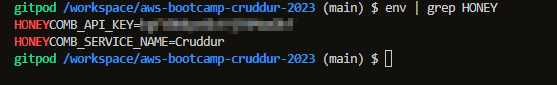

### 1.2.2. Add the following Environment Variables to `backend-flask` in docker compose

```yml
OTEL_EXPORTER_OTLP_ENDPOINT: "https://api.honeycomb.io"
OTEL_EXPORTER_OTLP_HEADERS: "x-honeycomb-team=${HONEYCOMB_API_KEY}"
OTEL_SERVICE_NAME: "${HONEYCOMB_SERVICE_NAME}"
```

### 1.2.3. Add the opentelemetry packages in the `requirements.txt`
- Add the following files to our `\aws-bootcamp-cruddur-2023\backend-flask\requirements.txt`

```
opentelemetry-api 
opentelemetry-sdk 
opentelemetry-exporter-otlp-proto-http 
opentelemetry-instrumentation-flask 
opentelemetry-instrumentation-requests
```

### 1.2.4. Then Install these dependencies:

```sh
cd backend-flask/
pip install -r requirements.txt
```
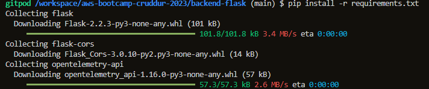

### 1.2.5. Add to the `app.py`

```py
from opentelemetry import trace
from opentelemetry.instrumentation.flask import FlaskInstrumentor
from opentelemetry.instrumentation.requests import RequestsInstrumentor
from opentelemetry.exporter.otlp.proto.http.trace_exporter import OTLPSpanExporter
from opentelemetry.sdk.trace import TracerProvider
from opentelemetry.sdk.trace.export import BatchSpanProcessor
```

### 1.2.6. Initialize tracing and an exporter that can send data to Honeycomb

```py
provider = TracerProvider()
processor = BatchSpanProcessor(OTLPSpanExporter())
provider.add_span_processor(processor)
trace.set_tracer_provider(provider)
tracer = trace.get_tracer(__name__)
```

### 1.2.7. Initialize automatic instrumentation with Flask

```py
app = Flask(__name__)
FlaskInstrumentor().instrument_app(app)
RequestsInstrumentor().instrument()
```

### 1.2.8. Acquiring a Tracer

```py
trace = trace.get_tracer("home.activities")
```

### 1.2.9. Creating spans

```py

with tracer.start_as_current_span("http-handler"):
    with tracer.start_as_current_span("my-cool-function"):

```
### 1.2.10. Exploring Honeycomb
#### 1.2.10.1. Span Logs
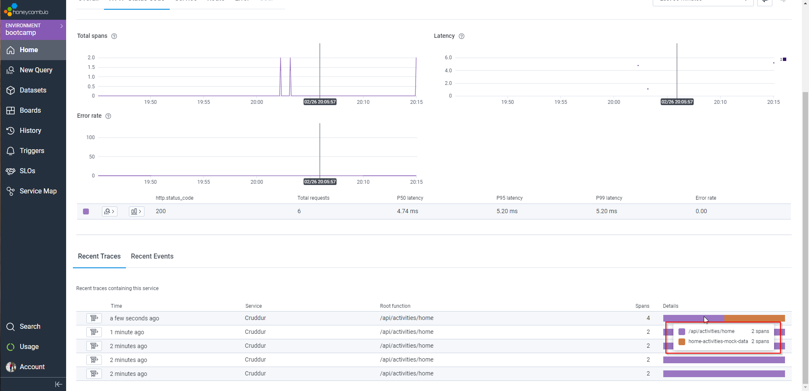
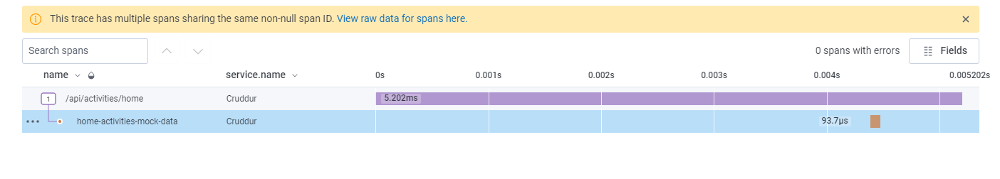
#### 1.2.10.2. app.now Logs
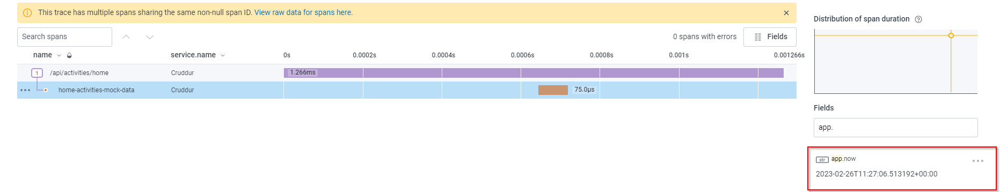
#### 1.2.10.3. app.result_length Logs
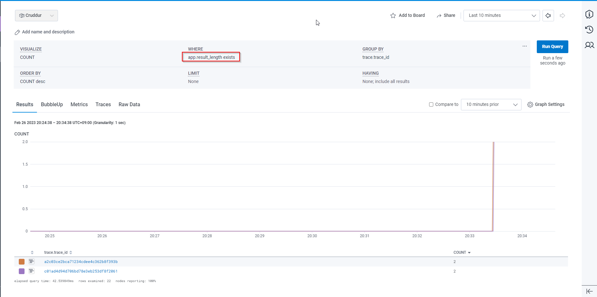
#### 1.2.10.4. Visualize MAX(app.result_length)
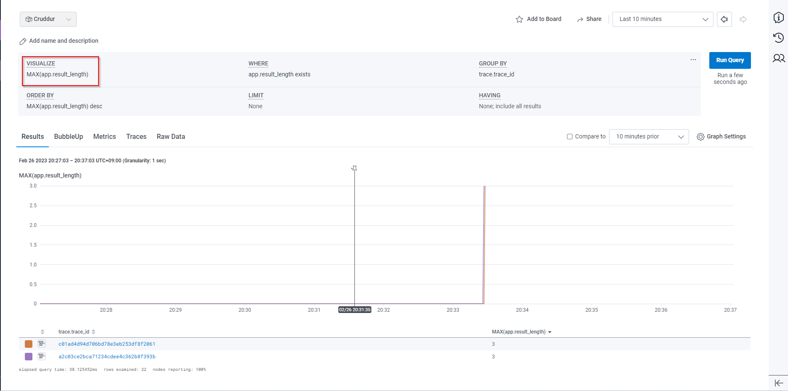
#### 1.2.10.5. Visualize HEATMAP(duration_ms) and P90(duration_ms)
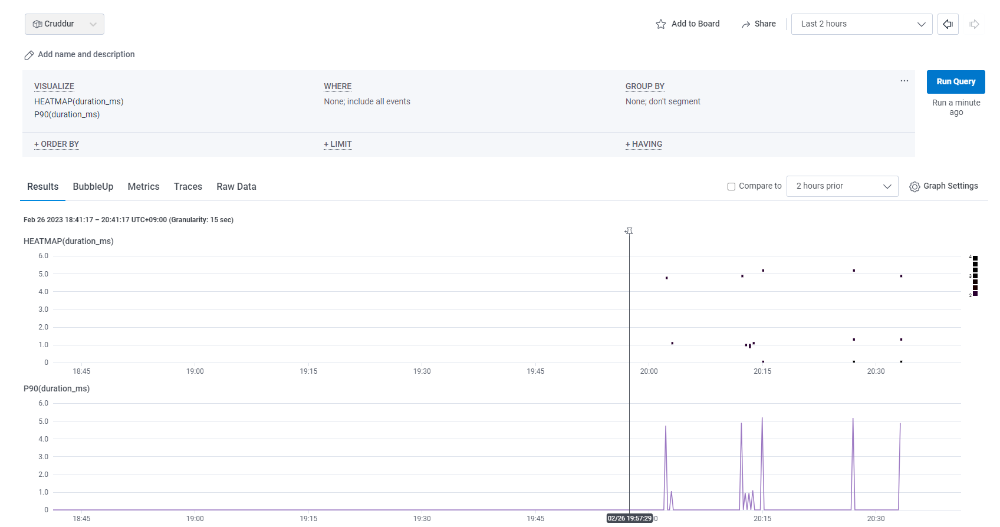

## 1.3. CloudWatch Logs

### 1.3.1. Setup CloudWatch

Add to the `requirements.txt`

```
watchtower
```
### 1.3.2. Install the CloudWatch library
```sh
pip install -r requirements.txt
```
### 1.3.3. Configure cloudwatch in `app.py`

```
import watchtower
import logging
from time import strftime
```
### 1.3.4. Configuring Logger to Use CloudWatch in `app.py`
```py

LOGGER = logging.getLogger(__name__)
LOGGER.setLevel(logging.DEBUG)
console_handler = logging.StreamHandler()
cw_handler = watchtower.CloudWatchLogHandler(log_group='cruddur')
LOGGER.addHandler(console_handler)
LOGGER.addHandler(cw_handler)
LOGGER.info("Test log")
```
### 1.3.5. For every request the logger should generate response use the below code in `app.py`
```py
@app.after_request
def after_request(response):
    timestamp = strftime('[%Y-%b-%d %H:%M]')
    LOGGER.error('%s %s %s %s %s %s', timestamp, request.remote_addr, request.method, request.scheme, request.full_path, response.status)
    return response
```

### 1.3.6. Setup logger in `home_activities.py`
```py
LOGGER.info('Hello Cloudwatch! from  /api/activities/home')
```
### 1.3.7. Setup the env var in your backend-flask for `docker-compose.yml`

```yml
      AWS_DEFAULT_REGION: "${AWS_DEFAULT_REGION}"
      AWS_ACCESS_KEY_ID: "${AWS_ACCESS_KEY_ID}"
      AWS_SECRET_ACCESS_KEY: "${AWS_SECRET_ACCESS_KEY}"
```
### 1.3.8. Check in cloudwatch for the logs
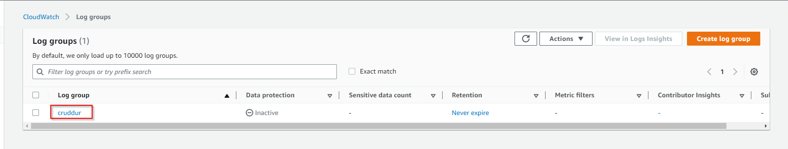
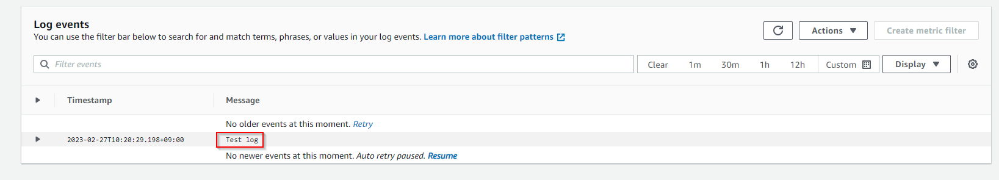
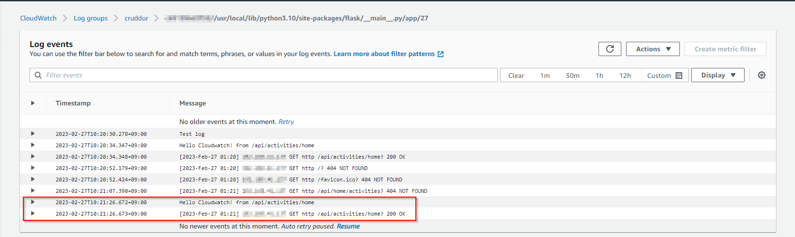

## 1.4. X-Ray

### 1.4.1. Setup X-Ray
Add to the `requirements.txt`

```py
aws-xray-sdk
```

### 1.4.2. Install python dependencies

```sh
pip install -r requirements.txt
```

###  1.4.3. Configuring xray to use CloudWatch in `app.py`

```py
from aws_xray_sdk.core import xray_recorder
from aws_xray_sdk.ext.flask.middleware import XRayMiddleware
xray_url = os.getenv("AWS_XRAY_URL")
xray_recorder.configure(service='backend-flask', dynamic_naming=xray_url)
XRayMiddleware(app, xray_recorder)
```

###  1.4.4. Setup AWS X-Ray Resources

Add `aws/json/xray.json`

```json
{
  "SamplingRule": {
      "RuleName": "Cruddur",
      "ResourceARN": "*",
      "Priority": 9000,
      "FixedRate": 0.1,
      "ReservoirSize": 5,
      "ServiceName": "Cruddur",
      "ServiceType": "*",
      "Host": "*",
      "HTTPMethod": "*",
      "URLPath": "*",
      "Version": 1
  }
}
```
###  1.4.5. Setup AWS X-Ray Group
```sh
FLASK_ADDRESS="https://4567-${GITPOD_WORKSPACE_ID}.${GITPOD_WORKSPACE_CLUSTER_HOST}"
aws xray create-group \
   --group-name "Cruddur" \
   --filter-expression "service(\"backend-flask\")"
```

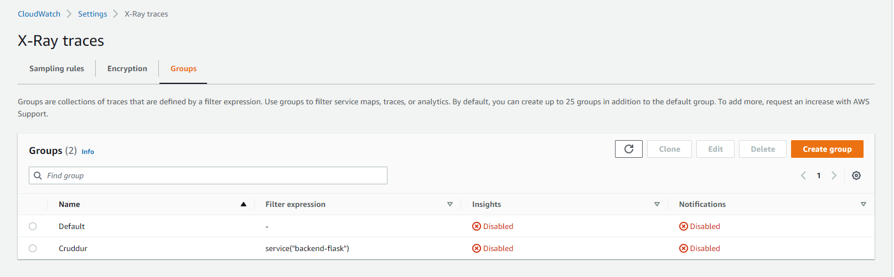

###  1.4.6. Setup AWS X-Ray Sampling Groups
```sh
aws xray create-sampling-rule --cli-input-json file://aws/json/xray.json
```
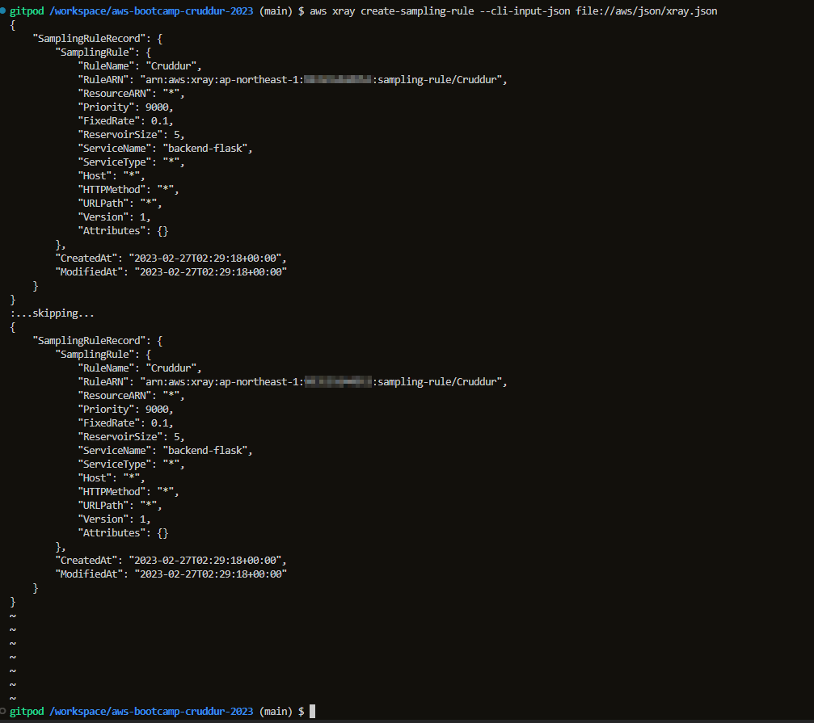
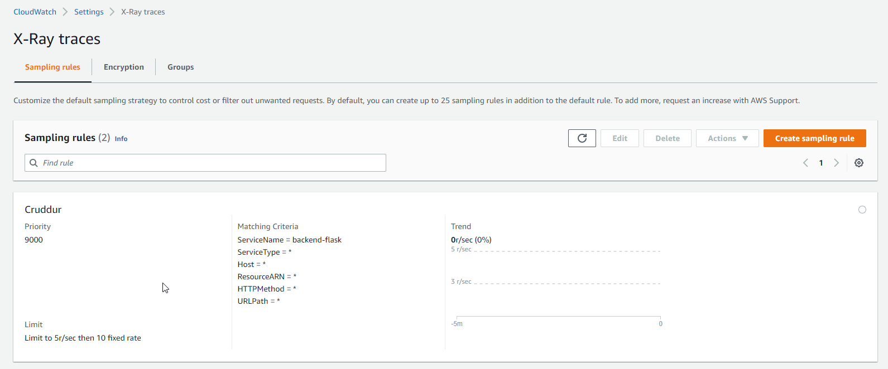

### 1.4.7. Add Deamon Service to Docker Compose

```yml
  xray-daemon:
    image: "amazon/aws-xray-daemon"
    environment:
      AWS_ACCESS_KEY_ID: "${AWS_ACCESS_KEY_ID}"
      AWS_SECRET_ACCESS_KEY: "${AWS_SECRET_ACCESS_KEY}"
      AWS_REGION: "${AWS_REGION}"
    command:
      - "xray -o -b xray-daemon:2000"
    ports:
      - 2000:2000/udp
```

### 1.4.8. Add these two env vars to our backend-flask in our `docker-compose.yml` file

```yml
      AWS_XRAY_URL: "*4567-${GITPOD_WORKSPACE_ID}.${GITPOD_WORKSPACE_CLUSTER_HOST}*"
      AWS_XRAY_DAEMON_ADDRESS: "xray-daemon:2000"
```

### 1.4.9. Hit some backend api activities and check xrays in aws
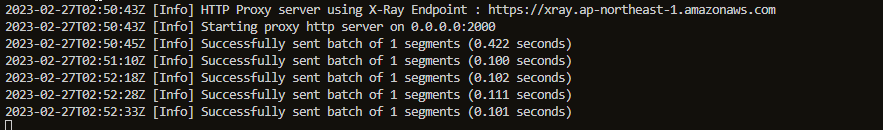
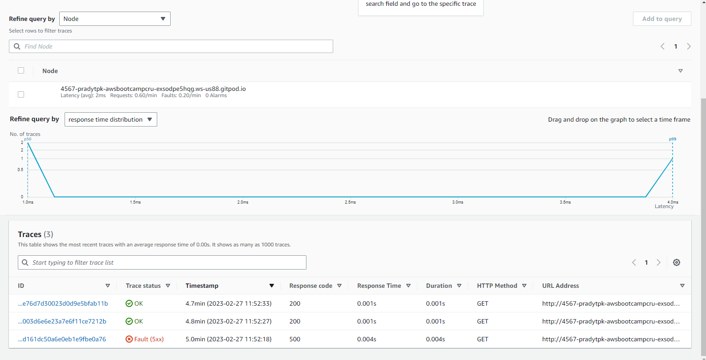


## 1.5. Rollbar

https://rollbar.com/

Create a new project in Rollbar called `Cruddur`

Add to `requirements.txt`


```
blinker
rollbar
```

Install deps

```sh
pip install -r requirements.txt
```

We need to set our access token

```sh
export ROLLBAR_ACCESS_TOKEN=""
gp env ROLLBAR_ACCESS_TOKEN=""
```

Add to backend-flask for `docker-compose.yml`

```yml
ROLLBAR_ACCESS_TOKEN: "${ROLLBAR_ACCESS_TOKEN}"
```

Import for Rollbar

```py
import rollbar
import rollbar.contrib.flask
from flask import got_request_exception
```

```py
rollbar_access_token = os.getenv('ROLLBAR_ACCESS_TOKEN')
@app.before_first_request
def init_rollbar():
    """init rollbar module"""
    rollbar.init(
        # access token
        rollbar_access_token,
        # environment name
        'production',
        # server root directory, makes tracebacks prettier
        root=os.path.dirname(os.path.realpath(__file__)),
        # flask already sets up logging
        allow_logging_basic_config=False)
    # send exceptions from `app` to rollbar, using flask's signal system.
    got_request_exception.connect(rollbar.contrib.flask.report_exception, app)
```

We'll add an endpoint just for testing rollbar to `app.py`

```py
@app.route('/rollbar/test')
def rollbar_test():
    rollbar.report_message('Hello World!', 'warning')
    return "Hello World!"
```


[Rollbar Flask Example](https://github.com/rollbar/rollbar-flask-example/blob/master/hello.py)