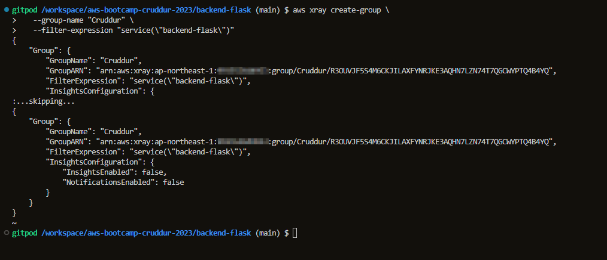

# 1. Week 2 — Distributed Tracing
- [1. Week 2 — Distributed Tracing](#1-week-2--distributed-tracing)
  - [1.1. HoneyComb](#11-honeycomb)
    - [1.1.1. Setup Honeycomb API key in gitpod](#111-setup-honeycomb-api-key-in-gitpod)
    - [1.1.2. Add the following Environment Variables to `backend-flask` in docker compose](#112-add-the-following-environment-variables-to-backend-flask-in-docker-compose)
    - [1.1.3. Add the opentelemetry packages in the `requirements.txt`](#113-add-the-opentelemetry-packages-in-the-requirementstxt)
    - [1.1.4. Then Install these dependencies:](#114-then-install-these-dependencies)
    - [1.1.5. Add to the `app.py`](#115-add-to-the-apppy)
    - [1.1.6. Initialize tracing and an exporter that can send data to Honeycomb](#116-initialize-tracing-and-an-exporter-that-can-send-data-to-honeycomb)
    - [1.1.7. Initialize automatic instrumentation with Flask](#117-initialize-automatic-instrumentation-with-flask)
    - [1.1.8. Acquiring a Tracer](#118-acquiring-a-tracer)
    - [1.1.9. Creating spans](#119-creating-spans)
    - [1.1.10. Exploring Honeycomb](#1110-exploring-honeycomb)
      - [1.1.10.1. Span Logs](#11101-span-logs)
      - [1.1.10.2. app.now Logs](#11102-appnow-logs)
      - [1.1.10.3. app.result\_length Logs](#11103-appresult_length-logs)
      - [1.1.10.4. Visualize MAX(app.result\_length)](#11104-visualize-maxappresult_length)
      - [1.1.10.5. Visualize HEATMAP(duration\_ms) and P90(duration\_ms)](#11105-visualize-heatmapduration_ms-and-p90duration_ms)
  - [1.2. CloudWatch Logs](#12-cloudwatch-logs)
    - [1.2.1. Setup CloudWatch](#121-setup-cloudwatch)
    - [1.2.2. Install the CloudWatch library](#122-install-the-cloudwatch-library)
    - [1.2.3. Configure cloudwatch in `app.py`](#123-configure-cloudwatch-in-apppy)
    - [1.2.4. Configuring Logger to Use CloudWatch in `app.py`](#124-configuring-logger-to-use-cloudwatch-in-apppy)
    - [1.2.5. For every request the logger should generate response use the below code in `app.py`](#125-for-every-request-the-logger-should-generate-response-use-the-below-code-in-apppy)
    - [1.2.6. Setup logger in `home_activities.py`](#126-setup-logger-in-home_activitiespy)
    - [1.2.7. Setup the env var in your backend-flask for `docker-compose.yml`](#127-setup-the-env-var-in-your-backend-flask-for-docker-composeyml)
    - [1.2.8. Check in cloudwatch for the logs](#128-check-in-cloudwatch-for-the-logs)
  - [1.3. X-Ray](#13-x-ray)
    - [1.3.1. Setup X-Ray](#131-setup-x-ray)
    - [1.3.2. Install python dependencies](#132-install-python-dependencies)
    - [1.3.3. Configuring xray to use CloudWatch in `app.py`](#133-configuring-xray-to-use-cloudwatch-in-apppy)
    - [1.3.4. Setup AWS X-Ray Resources](#134-setup-aws-x-ray-resources)
    - [1.3.5. Setup AWS X-Ray Group](#135-setup-aws-x-ray-group)
    - [1.3.6. Setup AWS X-Ray Sampling Groups](#136-setup-aws-x-ray-sampling-groups)
    - [1.3.7. Add Deamon Service to Docker Compose](#137-add-deamon-service-to-docker-compose)
    - [1.3.8. Add these two env vars to our backend-flask in our `docker-compose.yml` file](#138-add-these-two-env-vars-to-our-backend-flask-in-our-docker-composeyml-file)
    - [1.3.9. Hit some backend api activities and check xrays in aws](#139-hit-some-backend-api-activities-and-check-xrays-in-aws)
  - [1.4. Rollbar](#14-rollbar)

## 1.1. HoneyComb
### 1.1.1. Setup Honeycomb API key in gitpod
- Create a new Environment in ui.honeycomb.io
- Get the api keys for the services
```sh
export HONEYCOMB_API_KEY="MY API KEY"
export HONEYCOMB_SERVICE_NAME="Cruddur"
gp env HONEYCOMB_API_KEY="MY API KEY"
gp env HONEYCOMB_SERVICE_NAME="Cruddur"
env | grep HONEY
```


### 1.1.2. Add the following Environment Variables to `backend-flask` in docker compose

```yml
OTEL_EXPORTER_OTLP_ENDPOINT: "https://api.honeycomb.io"
OTEL_EXPORTER_OTLP_HEADERS: "x-honeycomb-team=${HONEYCOMB_API_KEY}"
OTEL_SERVICE_NAME: "${HONEYCOMB_SERVICE_NAME}"
```

### 1.1.3. Add the opentelemetry packages in the `requirements.txt`
- Add the following files to our `\aws-bootcamp-cruddur-2023\backend-flask\requirements.txt`

```
opentelemetry-api 
opentelemetry-sdk 
opentelemetry-exporter-otlp-proto-http 
opentelemetry-instrumentation-flask 
opentelemetry-instrumentation-requests
```

### 1.1.4. Then Install these dependencies:

```sh
cd backend-flask/
pip install -r requirements.txt
```


### 1.1.5. Add to the `app.py`

```py
from opentelemetry import trace
from opentelemetry.instrumentation.flask import FlaskInstrumentor
from opentelemetry.instrumentation.requests import RequestsInstrumentor
from opentelemetry.exporter.otlp.proto.http.trace_exporter import OTLPSpanExporter
from opentelemetry.sdk.trace import TracerProvider
from opentelemetry.sdk.trace.export import BatchSpanProcessor
```

### 1.1.6. Initialize tracing and an exporter that can send data to Honeycomb

```py
provider = TracerProvider()
processor = BatchSpanProcessor(OTLPSpanExporter())
provider.add_span_processor(processor)
trace.set_tracer_provider(provider)
tracer = trace.get_tracer(__name__)
```

### 1.1.7. Initialize automatic instrumentation with Flask

```py
app = Flask(__name__)
FlaskInstrumentor().instrument_app(app)
RequestsInstrumentor().instrument()
```

### 1.1.8. Acquiring a Tracer

```py
trace = trace.get_tracer("home.activities")
```

### 1.1.9. Creating spans

```py

with tracer.start_as_current_span("http-handler"):
    with tracer.start_as_current_span("my-cool-function"):

```
### 1.1.10. Exploring Honeycomb
#### 1.1.10.1. Span Logs


#### 1.1.10.2. app.now Logs

#### 1.1.10.3. app.result_length Logs

#### 1.1.10.4. Visualize MAX(app.result_length)

#### 1.1.10.5. Visualize HEATMAP(duration_ms) and P90(duration_ms)


## 1.2. CloudWatch Logs

### 1.2.1. Setup CloudWatch

Add to the `requirements.txt`

```
watchtower
```
### 1.2.2. Install the CloudWatch library
```sh
pip install -r requirements.txt
```
### 1.2.3. Configure cloudwatch in `app.py`

```
import watchtower
import logging
from time import strftime
```
### 1.2.4. Configuring Logger to Use CloudWatch in `app.py`
```py

LOGGER = logging.getLogger(__name__)
LOGGER.setLevel(logging.DEBUG)
console_handler = logging.StreamHandler()
cw_handler = watchtower.CloudWatchLogHandler(log_group='cruddur')
LOGGER.addHandler(console_handler)
LOGGER.addHandler(cw_handler)
LOGGER.info("Test log")
```
### 1.2.5. For every request the logger should generate response use the below code in `app.py`
```py
@app.after_request
def after_request(response):
    timestamp = strftime('[%Y-%b-%d %H:%M]')
    LOGGER.error('%s %s %s %s %s %s', timestamp, request.remote_addr, request.method, request.scheme, request.full_path, response.status)
    return response
```

### 1.2.6. Setup logger in `home_activities.py`
```py
LOGGER.info('Hello Cloudwatch! from  /api/activities/home')
```
### 1.2.7. Setup the env var in your backend-flask for `docker-compose.yml`

```yml
      AWS_DEFAULT_REGION: "${AWS_DEFAULT_REGION}"
      AWS_ACCESS_KEY_ID: "${AWS_ACCESS_KEY_ID}"
      AWS_SECRET_ACCESS_KEY: "${AWS_SECRET_ACCESS_KEY}"
```
### 1.2.8. Check in cloudwatch for the logs


## 1.3. X-Ray

### 1.3.1. Setup X-Ray
Add to the `requirements.txt`

```py
aws-xray-sdk
```

### 1.3.2. Install python dependencies

```sh
pip install -r requirements.txt
```

###  1.3.3. Configuring xray to use CloudWatch in `app.py`

```py
from aws_xray_sdk.core import xray_recorder
from aws_xray_sdk.ext.flask.middleware import XRayMiddleware
xray_url = os.getenv("AWS_XRAY_URL")
xray_recorder.configure(service='backend-flask', dynamic_naming=xray_url)
XRayMiddleware(app, xray_recorder)
```

###  1.3.4. Setup AWS X-Ray Resources

Add `aws/json/xray.json`

```json
{
  "SamplingRule": {
      "RuleName": "Cruddur",
      "ResourceARN": "*",
      "Priority": 9000,
      "FixedRate": 0.1,
      "ReservoirSize": 5,
      "ServiceName": "Cruddur",
      "ServiceType": "*",
      "Host": "*",
      "HTTPMethod": "*",
      "URLPath": "*",
      "Version": 1
  }
}
```
###  1.3.5. Setup AWS X-Ray Group
```sh
FLASK_ADDRESS="https://4567-${GITPOD_WORKSPACE_ID}.${GITPOD_WORKSPACE_CLUSTER_HOST}"
aws xray create-group \
   --group-name "Cruddur" \
   --filter-expression "service(\"backend-flask\")"
```



###  1.3.6. Setup AWS X-Ray Sampling Groups
```sh
aws xray create-sampling-rule --cli-input-json file://aws/json/xray.json
```


### 1.3.7. Add Deamon Service to Docker Compose

```yml
  xray-daemon:
    image: "amazon/aws-xray-daemon"
    environment:
      AWS_ACCESS_KEY_ID: "${AWS_ACCESS_KEY_ID}"
      AWS_SECRET_ACCESS_KEY: "${AWS_SECRET_ACCESS_KEY}"
      AWS_REGION: "${AWS_REGION}"
    command:
      - "xray -o -b xray-daemon:2000"
    ports:
      - 2000:2000/udp
```

### 1.3.8. Add these two env vars to our backend-flask in our `docker-compose.yml` file

```yml
      AWS_XRAY_URL: "*4567-${GITPOD_WORKSPACE_ID}.${GITPOD_WORKSPACE_CLUSTER_HOST}*"
      AWS_XRAY_DAEMON_ADDRESS: "xray-daemon:2000"
```

### 1.3.9. Hit some backend api activities and check xrays in aws


## 1.4. Rollbar

https://rollbar.com/

Create a new project in Rollbar called `Cruddur`

Add to `requirements.txt`


```
blinker
rollbar
```

Install deps

```sh
pip install -r requirements.txt
```

We need to set our access token

```sh
export ROLLBAR_ACCESS_TOKEN=""
gp env ROLLBAR_ACCESS_TOKEN=""
```

Add to backend-flask for `docker-compose.yml`

```yml
ROLLBAR_ACCESS_TOKEN: "${ROLLBAR_ACCESS_TOKEN}"
```

Import for Rollbar

```py
import rollbar
import rollbar.contrib.flask
from flask import got_request_exception
```

```py
rollbar_access_token = os.getenv('ROLLBAR_ACCESS_TOKEN')
@app.before_first_request
def init_rollbar():
    """init rollbar module"""
    rollbar.init(
        # access token
        rollbar_access_token,
        # environment name
        'production',
        # server root directory, makes tracebacks prettier
        root=os.path.dirname(os.path.realpath(__file__)),
        # flask already sets up logging
        allow_logging_basic_config=False)
    # send exceptions from `app` to rollbar, using flask's signal system.
    got_request_exception.connect(rollbar.contrib.flask.report_exception, app)
```

We'll add an endpoint just for testing rollbar to `app.py`

```py
@app.route('/rollbar/test')
def rollbar_test():
    rollbar.report_message('Hello World!', 'warning')
    return "Hello World!"
```


[Rollbar Flask Example](https://github.com/rollbar/rollbar-flask-example/blob/master/hello.py)