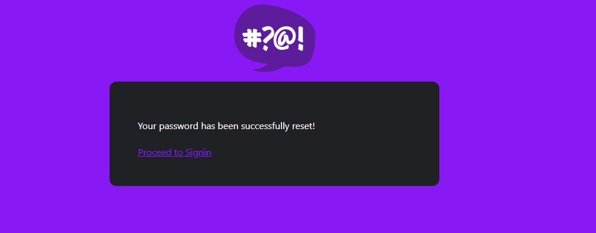

# 1. Week 3 — Decentralized Authentication
- [1. Week 3 — Decentralized Authentication](#1-week-3--decentralized-authentication)
  - [1.1. Task List](#11-task-list)
  - [1.2. AWS Cognito and AWS Amplify](#12-aws-cognito-and-aws-amplify)
    - [1.2.1. Provision Cognito User Group](#121-provision-cognito-user-group)
    - [1.2.2. Install AWS Amplify](#122-install-aws-amplify)
    - [1.2.3. Configure Amplify](#123-configure-amplify)
    - [1.2.4. Conditionally show components based on logged in or logged out](#124-conditionally-show-components-based-on-logged-in-or-logged-out)
      - [1.2.4.1. Update `HomeFeedPage.js`](#1241-update-homefeedpagejs)
      - [1.2.4.2. Update `DesktopNavigation.js`](#1242-update-desktopnavigationjs)
      - [1.2.4.3. Update `ProfileInfo.js`](#1243-update-profileinfojs)
      - [1.2.4.4. Update `DesktopSidebar.js`](#1244-update-desktopsidebarjs)
  - [1.3. Implement Custom Signin Page](#13-implement-custom-signin-page)
    - [1.3.1. How to change User Status FORCE\_CHANGE\_PASSWORD](#131-how-to-change-user-status-force_change_password)
  - [1.4. Implement Custom Signup Page](#14-implement-custom-signup-page)
  - [1.5. Implement Custom Confirmation Page](#15-implement-custom-confirmation-page)
    - [1.5.1. Mail Code Verification Check](#151-mail-code-verification-check)
    - [1.5.2. Cruddur Code Verification check](#152-cruddur-code-verification-check)
    - [1.5.3. AWS user status check](#153-aws-user-status-check)
  - [1.6. Implement Custom Recovery Page](#16-implement-custom-recovery-page)
  - [1.7. Authenticating Server Side](#17-authenticating-server-side)
    - [1.7.1. Without Authenticating](#171-without-authenticating)
    - [1.7.2. With Authenticating](#172-with-authenticating)
  - [1.8. Amazon Cognito Security Best Practices](#18-amazon-cognito-security-best-practices)
    - [1.8.1. Common Types of App Authorization](#181-common-types-of-app-authorization)
    - [1.8.2. What is Decentralized Authentication](#182-what-is-decentralized-authentication)
    - [1.8.3. What is Amazon Cognito](#183-what-is-amazon-cognito)
    - [1.8.4. Why use Amazon Cognito](#184-why-use-amazon-cognito)
    - [1.8.5. Best Practices](#185-best-practices)
    - [1.8.6. Note](#186-note)

##  1.1. Task List
- [x] Watch Week 3 Live-Stream Video(05/03/2023)
- [ ] Watch Chirag Week 3 - Spending Considerations
- [x] Setup Cognito User Pool(05/03/2023)
- [x] Implement Custom Signin Page(05/03/2023)
- [x] Implement Custom Signup Page(07/03/2023)
- [x] Implement Custom Confirmation Page(07/03/2023)
- [x] Implement Custom Recovery Page(07/03/2023)
- [x] Cognito JWT Server Side Verify(08/03/2023)
- [x] Exploring JWTs(09/03/2023)
- [x] Improving UI Contrast and Implementing CSS Variables for Theming(09/03/2023)
- [x] Amazon Cognito Security Best Practices(10/03/2023)


## 1.2. AWS Cognito and AWS Amplify

### 1.2.1. Provision Cognito User Group
- Create a Cognito User Group


### 1.2.2. Install AWS Amplify

```sh
npm i aws-amplify --save
```


### 1.2.3. Configure Amplify
- Hook up our cognito pool to our code in the `App.js`

```js
import { Amplify } from 'aws-amplify';
Amplify.configure({
  "AWS_PROJECT_REGION": process.env.REACT_APP_AWS_PROJECT_REGION,
  "aws_cognito_region": process.env.REACT_APP_AWS_COGNITO_REGION,
  "aws_user_pools_id": process.env.REACT_APP_AWS_USER_POOLS_ID,
  "aws_user_pools_web_client_id": process.env.REACT_APP_CLIENT_ID,
  "oauth": {},
  Auth: {
    // We are not using an Identity Pool
    // identityPoolId: process.env.REACT_APP_IDENTITY_POOL_ID, // REQUIRED - Amazon Cognito Identity Pool ID
    region: process.env.REACT_APP_AWS_PROJECT_REGION,           // REQUIRED - Amazon Cognito Region
    userPoolId: process.env.REACT_APP_AWS_USER_POOLS_ID,         // OPTIONAL - Amazon Cognito User Pool ID
    userPoolWebClientId: process.env.REACT_APP_CLIENT_ID,   // OPTIONAL - Amazon Cognito Web Client ID (26-char alphanumeric string)
  }
});
```

### 1.2.4. Conditionally show components based on logged in or logged out

#### 1.2.4.1. Update `HomeFeedPage.js`

```js
import { Auth } from 'aws-amplify';
// set a state
const [user, setUser] = React.useState(null);
// check if we are authenicated
const checkAuth = async () => {
  Auth.currentAuthenticatedUser({
    // Optional, By default is false. 
    // If set to true, this call will send a 
    // request to Cognito to get the latest user data
    bypassCache: false 
  })
  .then((user) => {
    console.log('user',user);
    return Auth.currentAuthenticatedUser()
  }).then((cognito_user) => {
      setUser({
        display_name: cognito_user.attributes.name,
        handle: cognito_user.attributes.preferred_username
      })
  })
  .catch((err) => console.log(err));
};
// check when the page loads if we are authenicated
React.useEffect(()=>{
  loadData();
  checkAuth();
}, [])
```
#### 1.2.4.2. Update `DesktopNavigation.js`
- We'll want to pass user to the following components:

```js
<DesktopNavigation user={user} active={'home'} setPopped={setPopped} />
<DesktopSidebar user={user} />
```

- We'll rewrite `DesktopNavigation.js` so that it it conditionally shows links in the left hand column
- on whether you are logged in or not.
- Notice we are passing the user to ProfileInfo

```js
import './DesktopNavigation.css';
import {ReactComponent as Logo} from './svg/logo.svg';
import DesktopNavigationLink from '../components/DesktopNavigationLink';
import CrudButton from '../components/CrudButton';
import ProfileInfo from '../components/ProfileInfo';
export default function DesktopNavigation(props) {
  let button;
  let profile;
  let notificationsLink;
  let messagesLink;
  let profileLink;
  if (props.user) {
    button = <CrudButton setPopped={props.setPopped} />;
    profile = <ProfileInfo user={props.user} />;
    notificationsLink = <DesktopNavigationLink 
      url="/notifications" 
      name="Notifications" 
      handle="notifications" 
      active={props.active} />;
    messagesLink = <DesktopNavigationLink 
      url="/messages"
      name="Messages"
      handle="messages" 
      active={props.active} />
    profileLink = <DesktopNavigationLink 
      url="/@andrewbrown" 
      name="Profile"
      handle="profile"
      active={props.active} />
  }
  return (
    <nav>
      <Logo className='logo' />
      <DesktopNavigationLink url="/" 
        name="Home"
        handle="home"
        active={props.active} />
      {notificationsLink}
      {messagesLink}
      {profileLink}
      <DesktopNavigationLink url="/#" 
        name="More" 
        handle="more"
        active={props.active} />
      {button}
      {profile}
    </nav>
  );
}
```
#### 1.2.4.3. Update `ProfileInfo.js`

```js
import { Auth } from 'aws-amplify';
const signOut = async () => {
  try {
      await Auth.signOut({ global: true });
      window.location.href = "/"
  } catch (error) {
      console.log('error signing out: ', error);
  }
}
```
#### 1.2.4.4. Update `DesktopSidebar.js`
- We'll rewrite `DesktopSidebar.js` so that it conditionally shows components in case you are logged in or not.

```js
import './DesktopSidebar.css';
import Search from '../components/Search';
import TrendingSection from '../components/TrendingsSection'
import SuggestedUsersSection from '../components/SuggestedUsersSection'
import JoinSection from '../components/JoinSection'
export default function DesktopSidebar(props) {
  const trendings = [
    {"hashtag": "100DaysOfCloud", "count": 2053 },
    {"hashtag": "CloudProject", "count": 8253 },
    {"hashtag": "AWS", "count": 9053 },
    {"hashtag": "FreeWillyReboot", "count": 7753 }
  ]
  const users = [
    {"display_name": "Andrew Brown", "handle": "andrewbrown"}
  ]
  let trending;
  let suggested;
  let join;
  if (props.user) {
    trending = <TrendingSection trendings={trendings} />
     suggested = <SuggestedUsersSection users={users} />
  }else {
    join = <JoinSection />
  } 
  return (
    <section>
      <Search />
      {trending}
      {suggested}
      {join}
      <footer>
        <a href="#">About</a>
        <a href="#">Terms of Service</a>
        <a href="#">Privacy Policy</a>
      </footer>
    </section>
  );
}
```

## 1.3. Implement Custom Signin Page

```js
import { Auth } from 'aws-amplify';
const [cognitoErrors, setErrors] = React.useState('');
  const onsubmit = async (event) => {
    setErrors('')
    event.preventDefault();
      Auth.signIn(email, password)
        .then(user => {
          localStorage.setItem("access_token", user.signInUserSession.accessToken.jwtToken)
          window.location.href = "/"
        }).catch(error => { 
          if (error.code === 'UserNotConfirmedException') {
            window.location.href = "/confirm"
          }
          setErrors(error.message)
         });
    return false
  }
```
### 1.3.1. How to change User Status FORCE_CHANGE_PASSWORD
```sh
aws cognito-idp admin-set-user-password \
  --user-pool-id <your-user-pool-id> \
  --username <username> \
  --password <password> \
  --permanent
```

## 1.4. Implement Custom Signup Page

```js
import { Auth } from 'aws-amplify';
const [errors, setErrors] = React.useState('');
const onsubmit = async (event) => {
  event.preventDefault();
  setErrors('')
  try {
      const { user } = await Auth.signUp({
        username: email,
        password: password,
        attributes: {
            name: name,
            email: email,
            preferred_username: username,
        },
        autoSignIn: { // optional - enables auto sign in after user is confirmed
            enabled: true,
        }
      });
      console.log(user);
      window.location.href = `/confirm?email=${email}`
  } catch (error) {
      console.log(error);
      setErrors(error.message)
  }
  return false
}
```

## 1.5. Implement Custom Confirmation Page

```js
import { Auth } from 'aws-amplify';
const resend_code = async (event) => {
  setErrors('')
  try {
    await Auth.resendSignUp(email);
    console.log('code resent successfully');
    setCodeSent(true)
  } catch (err) {
    // does not return a code
    // does cognito always return english
    // for this to be an okay match?
    console.log(err)
    if (err.message == 'Username cannot be empty'){
      setErrors("You need to provide an email in order to send Resend Activiation Code")   
    } else if (err.message == "Username/client id combination not found."){
      setErrors("Email is invalid or cannot be found.")   
    }
  }
}
const onsubmit = async (event) => {
  event.preventDefault();
  setErrors('')
  try {
    await Auth.confirmSignUp(email, code);
    window.location.href = "/"
  } catch (error) {
    setErrors(error.message)
  }
  return false
}
```
### 1.5.1. Mail Code Verification Check

### 1.5.2. Cruddur Code Verification check

### 1.5.3. AWS user status check


## 1.6. Implement Custom Recovery Page

```js
import { Auth } from 'aws-amplify';
const onsubmit_send_code = async (event) => {
  event.preventDefault();
  setErrors('')
  Auth.forgotPassword(username)
  .then((data) => setFormState('confirm_code') )
  .catch((err) => setErrors(err.message) );
  return false
}
const onsubmit_confirm_code = async (event) => {
  event.preventDefault();
  setErrors('')
  if (password == passwordAgain){
    Auth.forgotPasswordSubmit(username, code, password)
    .then((data) => setFormState('success'))
    .catch((err) => setErrors(err.message) );
  } else {
    setErrors('Passwords do not match')
  }
  return false
}
```


## 1.7. Authenticating Server Side
- Add in the `HomeFeedPage.js` a header eto pass along the access token
```js
  headers: {
    Authorization: `Bearer ${localStorage.getItem("access_token")}`
  }
```
In the `app.py`
```py
cors = CORS(
  app, 
  resources={r"/api/*": {"origins": origins}},
  headers=['Content-Type', 'Authorization'], 
  expose_headers='Authorization',
  methods="OPTIONS,GET,HEAD,POST"
)
```
### 1.7.1. Without Authenticating


### 1.7.2. With Authenticating


## 1.8. Amazon Cognito Security Best Practices
### 1.8.1. Common Types of App Authorization
- OAuth
- OpenID Connect
- Username and password
- SAML authentication
- Single Sign On 
- Identity Provider
- Traditional Authentication

### 1.8.2. What is Decentralized Authentication
- Decentralized authentication simply means that there is no central authority needed to verify your identity, i.e., decentralized identifiers. 
- DIDs (Decentralized Identifiers) are a special type of identifier that allows for decentralized, verified digital identification.

### 1.8.3. What is Amazon Cognito
- Cognito User Pool
- Cognito Identity Pool
- Amazon Cognito lets you easily add user sign-up and authentication to your mobile and web apps

### 1.8.4. Why use Amazon Cognito
- User Directory for customers
- Ability to access AWS Resources for the application being built
- Identity Broker for AWS Resources with Temporary credentials
- Can extend users to AWS resources easily
### 1.8.5. Best Practices
- AWS services - API Gateway,AWS Resources shared with the APP client
- AWS WAF with web ACLs for rate limiting,allow/deny list etc
- Amazon cognito compliance 
- Amazon organizations SCP
- AWS Cloud Trail is enabled and monitored to trigger alerts on malicious attacks.
- APP user LCM
- Encryption
- JWT Authentication
- Access Token Scope
### 1.8.6. Note
- Token LCM
- LCM